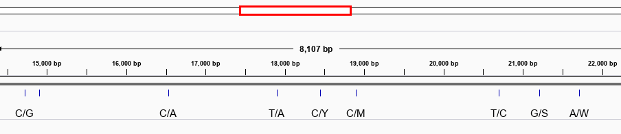

## pywgsim

pywgsim is a modified version of the wgsim short read simulator. 

* https://github.com/lh3/wgsim

The code for `wgsim` has been modified to allow visualizing the simulated mutations as a GFF file.



The package provides both a python wrapper and standalone compiled executables for Linux and MacOS.

## Installation

    pip install pywgsim

PyPI page: https://pypi.org/project/pywgsim/
 
## Usage

    $ pywgsim -h
    
prints:
    
```
usage: pywgsim [-h] [-e 0.02] [-D 500] [-s 50] [-N 1000] [-1 70] [-2 70]
               [-r 0.001] [-R 0.15] [-X 0.25] [-S 0] [-A 0.05] [-f]
               genome [read1] [read2]

positional arguments:
  genome                FASTA reference sequence
  read1                 FASTQ file for first in pair (read1.fq)
  read2                 FASTQ file for second in pair (read2.fq)

optional arguments:
  -h, --help            show this help message and exit
  -e 0.02, --err 0.02   the base error rate
  -D 500, --dist 500    outer distance between the two ends
  -s 50, --stdev 50     standard deviation
  -N 1000, --num 1000   number of read pairs
  -1 70, --L1 70        length of the first read
  -2 70, --L2 70        length of the second read
  -r 0.001, --mut 0.001
                        rate of mutations
  -R 0.15, --frac 0.15  fraction of indels
  -X 0.25, --ext 0.25   probability an indel is extended
  -S 0, --seed 0        seed for the random generator
  -A 0.05, --amb 0.05   disregard if the fraction of ambiguous bases higher
                        than FLOAT
  -f, --fixed           each chromosome gets N sequences
  ```

## Changes compared to wgsim

The original code for wgsim has been modified as follows:

1. The output describing the mutations introduced by `wgsim` are generated in GFF format.
1. The separator character in the read name has been changed from `_` to `|`. 
1. There is a new flag called `--fixed` that generates the same `N` number of reads for each chromosome.

### Read naming

The read naming now follows a more widely accepted convention (i.e. NCBI) and allows for contigs with underscores in them. In addition the visual inspection of the read names is easier: 

`@NC_002945.4|1768156|1768694|0:0:0|4:0:0|4`

### Fixed mode

In the default operation of wgsim the `N` reads are distributed such to create a uniform coverage across all chromosomes (longer chromosomes get a larger fraction of `N`). 

When the `--fixed` mode is enabled `N` reads will be generated for each chromosome. The `--fixed` mode was introduced to simplify the evaluation of classifiers. Since the same number of reads is generated from each input sequence it becomes simpler the assess the quality of classifications (i.e. how many out of `N` were classified correctly) 
 
## Mutation output

The tool simulates mutations assuming a diploid genome. The output generated by `pywgsim` will look like this:

```
##gff-version 3
#
# N=10000 err_rate=0 mut_rate=0.001 indel_frac=0.15000001 indel_ext=0.25 size=500 std=50 len1=70 len2=70 seed=1607013056
#
NC_001416.1    wgsim    snp    89      89      .    +    .    Name=A/R;Ref=A;Alt=R;Type=het
NC_001416.1    wgsim    snp    2825    2825    .    +    .    Name=-/A;Ref=-;Alt=A;Type=het
NC_001416.1    wgsim    snp    3712    3712    .    +    .    Name=G/A;Ref=G;Alt=A;Type=hom
NC_001416.1    wgsim    snp    4622    4622    .    +    .    Name=G/-;Ref=G;Alt=-;Type=hom
```

Interpretation: 

* `A/R` means heterozygous mutations with `A/A` and `A/G` alleles.
* `-/A` means an insertion of a `A` relative to the reference, the type field indicates heterozygous mutation.
* `G/A` means homozygous mutations with `G/A` alleles in both copies.
* `G/-` means a deletion of a `G` from the reference, the type field indicates homozygous mutation.

## Ambiguity codes

    A           A           T
    C           C           G
    G           G           C
    T/U         T           A
    M         A or C        K
    R         A or G        Y
    W         A or T        W
    S         C or G        S
    Y         C or T        R
    K         G or T        M
    V      A or C or G      B
    H      A or C or T      D
    D      A or G or T      H
    B      C or G or T      V
    N    G or A or T or C   N

## Read name conventions
   
The read names are now of the form:

       @NC_002945.4|1768156|1768694|0:0:0|4:0:0|4

Where:

   * `NC_002945.4` is the contig name that the fragment was generated from.
   * `1768156` is the left-most position of the fragment.
   * `1768694` is the right-most position of the fragment.
   * `0:0:0` are the number of errors, substitutions and indels in the left-most read of the pair.
   * `4:0:0` are the number of errors, substitutions and indels in the right-most read of the pair.
   * `4` is the read pair number, unique, per contig.


## API

The C interface to `wgsim` is accessible as a single function call 

    from pywgsim import wgsim

    wgsim.core(r1="read1.fq", r2="read2.fq", ref="genome.fa", err_rate=0.02, mut_rate=0.001, indel_frac=0.15, indel_ext=0.25, max_n=0.05, is_hap=0, N=100000,  dist=500, stdev=50, size_l=100, size_r=100, is_fixed=0, seed=0)
    
The function creates the files `r1` and `r2`.
